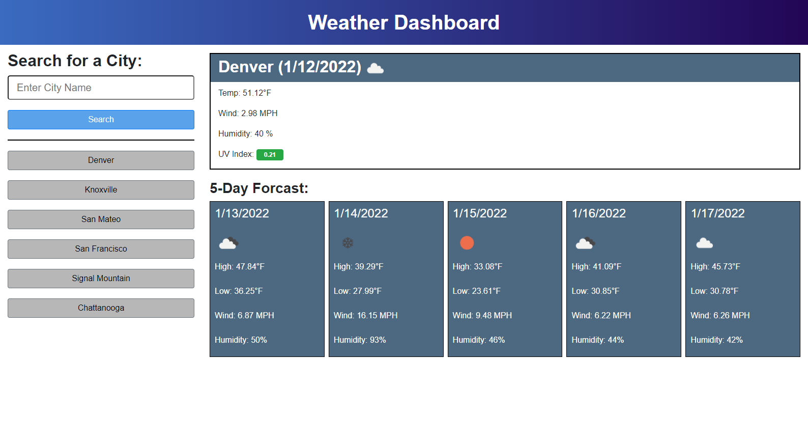

# The Weather of Today

## Description

This weather dashboard utilizes HTML, CSS, JS, jQuery, and Bootstrap. For weather data, it utilizes geolocation and One Call Api from OpenWeather.

There is a form to search a city name on the page. It gets the geolocation of the city, returning an alert if a city is not found or the request fails. If it succeeds, the city latitude and longitude is used to fetch weather data, which is then displayed on the page.

The page displays the current weather data and the weather for the next five days, which is all created dynamically.

There is a search history under the form that holds the past eight searches. If clicked, that city's information is displayed on the page, and it is put as the newest search on the search history.

The page responds dynamically to look good and function on various screen sizes. On screens smaller than large (based on Bootstrap), the search history is hidden, and the structure of the page adjusts.

The search history is saved and loaded from local storage. On a new visit, a blank current weather display is shown. Otherwise, the last search is pulled up automatically.

It is deployed at: https://spencerhulse.github.io/the-weather-of-today/

## Table of Contents

- [Installation](#installation)
- [Usage](#usage)
- [License](#license)
- [Contributing](#contributing)
- [Tests](#tests)
- [Questions](#questions)
  

## Installation

Simply open it up or clone the repo.

## Usage

Go to the page and type in a city in the search box to get the weather for that city.

## License

This project is covered under the following license:

[MIT](https://www.mit.edu/~amini/LICENSE.md)

## Contributing

No contributions at this time.

## Tests

Try typing in your city!

## Questions

If you wish to view more of my work, feel free to visit my GitHub account. Additionally, if you have any questions, you can contact me at the email address below. Thanks!

[GitHub](https://github.com/SpencerHulse)

<hulse.spencer@gmail.com>
